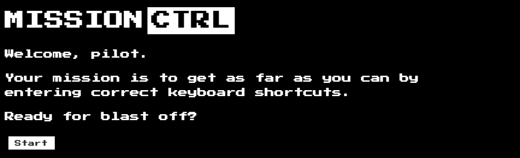
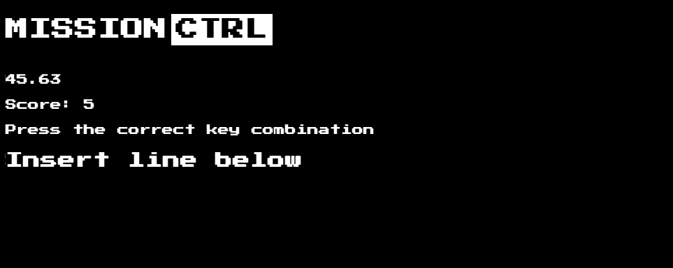
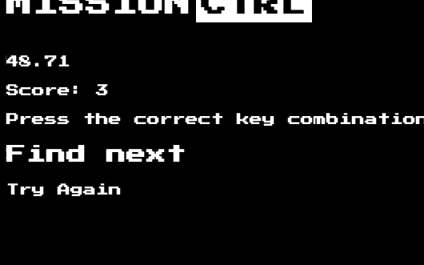
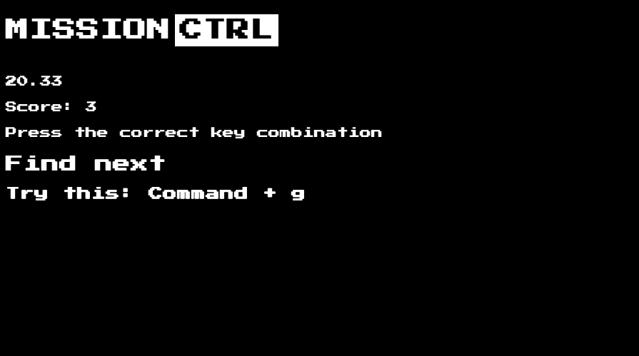
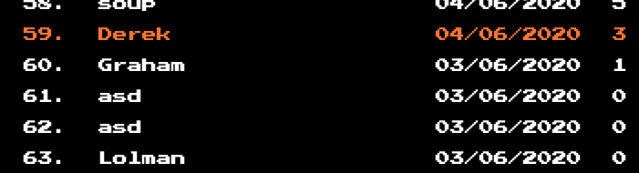

# Mission Ctrl

[](https://travis-ci.com/tommyrharper/mission-ctrl)

http://mission-ctrl.surge.sh

This was our final project at Makers Academ. The focus of the project was to take on a completely new tech stack and showcase our ability to follow AGILE processes and T.D.D when faced with such challenge.

# What is Mission-Ctrl?
Mission-ctrl is a game developed to help engineers hone their shortcut knowledge and practise them in a fun and competitive space ! 

We enable the user to reach great heights in our game with a sophisticated scoring system and allow them to enter their name and save their score on our database.

Our game is built with custom event-listeners that can detect multiple key-presses at a time and give feedback to the user about their attempt.


# Team Members
- [Gina Frankel](https://github.com/Gina-Frankel)
- [Alexa Kearns](https://github.com/alexakearns)
- [Thomas Harper](https://github.com/tommyrharper)
- [Alex Lewis](https://github.com/AlexLewis10)
- [Harry Turnbull](https://github.com/hturnbull93)
- [Graham Falconer](https://github.com/grahamfalconer)

# Technologies
| Purpose       | Technology     | 
| ------------- |:-------------: | 
| Framework     | React, Express |
| Language      | Javascript     | 
| CI/CD         | Travis         |
| Hosting       | Heroku, surge  |
| Databases     | MongoDB        |
| Styling      |   Sass, CSS     |
| Test framework| Jest, Enzyme   |
| Codecoverage  |    Jest        |


# How to install and run the project
First clone this repository to your local machine, then...

```
> cd mission-ctrl

> npm install

> npm start
```

Visit localhost:3000 (provided you dont have any other local servers running) and you should see:
--- Insert Intro page ---

# How to run tests

```
> npm test
```

This will show you passing, pending and failed tests as well as test coverage for the individual files and overall project.

# Playing the game
Simply click the start button to start running the game


Press down on the correct combination of keys to complete a question


If you get the question wrong you may receive a prompt such as


If you get the question wrong multiple times you will be given the correct answer but will face a reduced points amount


View your game feedback at the end to see how you can improve, if you're proud of your score, then enter your name and click submit to add it to our database!


Watch your name easily appear on the scoreboard



